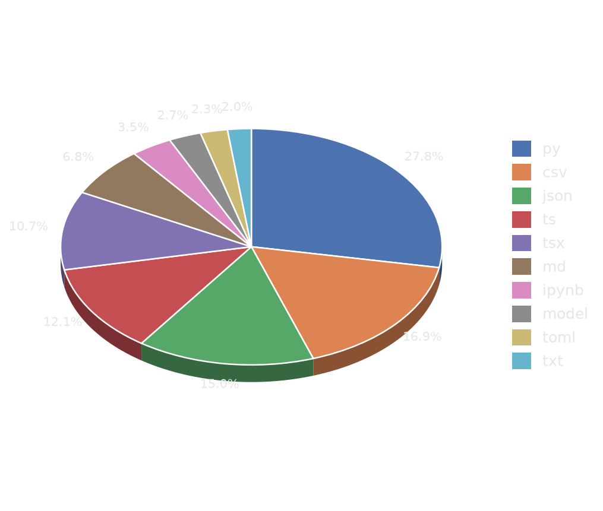

## Muhammad Yahya

Algorithmic trading, AI systems, backend engineering — Bogor, Indonesia

Deploying real systems, not just notebooks.

---

### Tech Stack

  

Also working with **MQL4/MQL5** (MetaTrader Expert Advisors) and **MediaPipe** (real-time gesture/vision).

---

### Projects (own work)

| Project | Stack | What it does |
|---|---|---|
| **[AgriTwin](https://github.com/Dhiyaahaq33/agritwin)** | FastAPI · Next.js/React · Supabase · MQTT · Gemini RAG · Docker | Greenhouse digital twin — IoT sensors, AI agronomist, market prices, migrated from a 15.6K-line Streamlit monolith |
| **[Agent-Sales-Woodchar](https://github.com/Dhiyaahaq33/Agent-Sales-Woodchar)** | CrewAI · Gemini/Groq · Gmail/Sheets API | 7-agent autonomous B2B sales pipeline for charcoal export — scraping, outreach, PDF quotes, Telegram reports |
| **ATRADEX** *(private)* | FastAPI · WebSocket · asyncpg · Supabase | Automated crypto trading bot — real-time market data, signal execution |
| **[forex-scalp-bot](https://github.com/Dhiyaahaq33/forex-scalp-bot)** | MQL4/MQL5 | Modular scalping EA — risk management, entry signal, news/session filters as separate includes |
| **FUTURE-MARKET** *(private)* | Flask · ccxt · Telegram Bot API | Futures price prediction & alert bot |
| **[MPD-SAG](https://github.com/Dhiyaahaq33/MPD-SAG)** | Python · C++ · MediaPipe · MQTT | Gesture-triggered smart agriculture IoT demo — vision-based activation, live NDVI panel |
| **binance-intelligence**, **automatic_trade**, **bandar-broksum** *(private)* | Python | Crypto & equity market-intelligence utilities |

Plus 10+ smaller experimental trading/automation bots across [public repos](https://github.com/Dhiyaahaq33?tab=repositories).

---

### Lines of Code

Code size across all repositories, own work + forks combined, via GitHub's Languages API (instant, no repo cloning). Auto-refreshed on every push (near real-time) with a daily fallback.

<!-- LOC-START -->
**21,152,287 total**

| Language | Lines | Share |
|---|---|---|
| py | 3669645 | 17.3% |
| csv | 3476431 | 16.4% |
| json | 2341694 | 11.1% |
| ts | 2042853 | 9.7% |
| tsx | 1969032 | 9.3% |
| md | 916648 | 4.3% |
| ipynb | 719536 | 3.4% |
| model | 562504 | 2.7% |
| txt | 482532 | 2.3% |
| toml | 471427 | 2.2% |
<!-- LOC-END -->

---

### External Contributions

Pull requests opened on other people's public repos (not forks — real upstream projects). Auto-refreshed daily.

<!-- CONTRIB-START -->
**Merged (2):** [squidKid-deluxe/QTradeX-Algo-Trading-SDK](https://github.com/squidKid-deluxe/QTradeX-Algo-Trading-SDK/pull/9) — fix: avoid spurious re-fetch of already-cached candles on end="now" startup, [squidKid-deluxe/QTradeX-Algo-Trading-SDK](https://github.com/squidKid-deluxe/QTradeX-Algo-Trading-SDK/pull/8) — feat: add Awesome Oscillator indicator

**Open / pending review (13):** [51bitquant/binance_grid_trader](https://github.com/51bitquant/binance_grid_trader/pulls), [AI4Finance-Foundation/FinRL-Meta](https://github.com/AI4Finance-Foundation/FinRL-Meta/pulls), [AI4Finance-Foundation/FinRobot](https://github.com/AI4Finance-Foundation/FinRobot/pulls), [HammerGPT/Hyper-Alpha-Arena](https://github.com/HammerGPT/Hyper-Alpha-Arena/pulls), [al1enjesus/polymarket-whales](https://github.com/al1enjesus/polymarket-whales/pulls), [cunarist/solie](https://github.com/cunarist/solie/pulls) (x2), [diogomatoschaves/MyCryptoBot](https://github.com/diogomatoschaves/MyCryptoBot/pulls), [freqtrade/freqtrade](https://github.com/freqtrade/freqtrade/pulls), [himanshu2406/Algo.Py](https://github.com/himanshu2406/Algo.Py/pulls), [pkjmesra/PKScreener](https://github.com/pkjmesra/PKScreener/pulls) (x2), [whchien/ai-trader](https://github.com/whchien/ai-trader/pulls)
<!-- CONTRIB-END -->

---

### Forked (tools I use / study, unmodified)

**Agent & AI tooling:** [ruflo](https://github.com/Dhiyaahaq33/ruflo), [ponytail](https://github.com/Dhiyaahaq33/ponytail), [career-ops](https://github.com/Dhiyaahaq33/career-ops), [ui-ux-pro-max-skill](https://github.com/Dhiyaahaq33/ui-ux-pro-max-skill), [free-claude-code](https://github.com/Dhiyaahaq33/free-claude-code), [graphify](https://github.com/Dhiyaahaq33/graphify), [OpenHands](https://github.com/Dhiyaahaq33/OpenHands), [browser-use](https://github.com/Dhiyaahaq33/browser-use), [langflow](https://github.com/Dhiyaahaq33/langflow), [dify](https://github.com/Dhiyaahaq33/dify)

**Self-hosted / LLM infra:** [ollama](https://github.com/Dhiyaahaq33/ollama), [open-webui](https://github.com/Dhiyaahaq33/open-webui), [coolify](https://github.com/Dhiyaahaq33/coolify), [supabase](https://github.com/Dhiyaahaq33/supabase), [vaultwarden](https://github.com/Dhiyaahaq33/vaultwarden), [Stirling-PDF](https://github.com/Dhiyaahaq33/Stirling-PDF), [community-edition](https://github.com/Dhiyaahaq33/community-edition) (Plausible)

**Data & media ML:** [crawl4ai](https://github.com/Dhiyaahaq33/crawl4ai), [maxun](https://github.com/Dhiyaahaq33/maxun), [yt-dlp](https://github.com/Dhiyaahaq33/yt-dlp), [whisper](https://github.com/Dhiyaahaq33/whisper), [Fooocus](https://github.com/Dhiyaahaq33/Fooocus)

**Quant research:** [qlib](https://github.com/Dhiyaahaq33/qlib), [gs-quant](https://github.com/Dhiyaahaq33/gs-quant), [machine-learning-for-trading](https://github.com/Dhiyaahaq33/machine-learning-for-trading), [TradingAgents](https://github.com/Dhiyaahaq33/TradingAgents), [awesome-quant](https://github.com/Dhiyaahaq33/awesome-quant), [Financial-Models-Numerical-Methods](https://github.com/Dhiyaahaq33/Financial-Models-Numerical-Methods), [Computational-Finance-Course](https://github.com/Dhiyaahaq33/Computational-Finance-Course), [QuantDingerCahyo](https://github.com/Dhiyaahaq33/QuantDingerCahyo), [AUTO-TRADE-FLEXIBLE](https://github.com/Dhiyaahaq33/AUTO-TRADE-FLEXIBLE), [binance-public-data-cahyo](https://github.com/Dhiyaahaq33/binance-public-data-cahyo), [freqtrade](https://github.com/Dhiyaahaq33/freqtrade), [FinRobot](https://github.com/Dhiyaahaq33/FinRobot), [FinRL-Meta](https://github.com/Dhiyaahaq33/FinRL-Meta), [QTradeX-Algo-Trading-SDK](https://github.com/Dhiyaahaq33/QTradeX-Algo-Trading-SDK), [binance_grid_trader](https://github.com/Dhiyaahaq33/binance_grid_trader), [polymarket-whales](https://github.com/Dhiyaahaq33/polymarket-whales), [PKScreener](https://github.com/Dhiyaahaq33/PKScreener)

**Other:** [turbovec](https://github.com/Dhiyaahaq33/turbovec) (Rust vector index), [OpenAlice](https://github.com/Dhiyaahaq33/OpenAlice) (trading agent), [G0DM0D3](https://github.com/Dhiyaahaq33/G0DM0D3) (chat UI), [coss](https://github.com/Dhiyaahaq33/coss) (design system), [MiroFish](https://github.com/Dhiyaahaq33/MiroFish) (swarm prediction engine)

---

*Markets are data problems. Solve them with code.*
